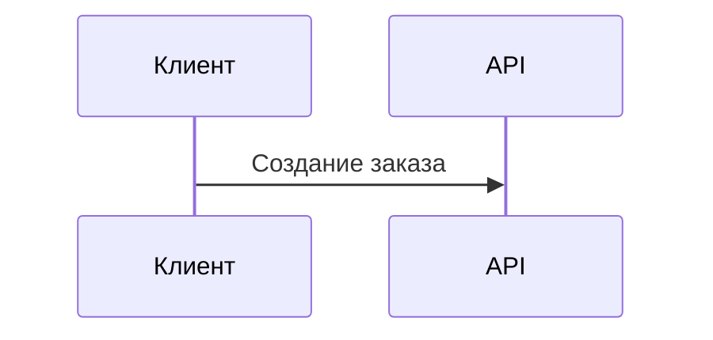
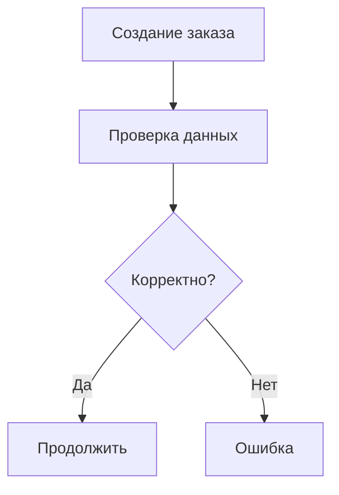
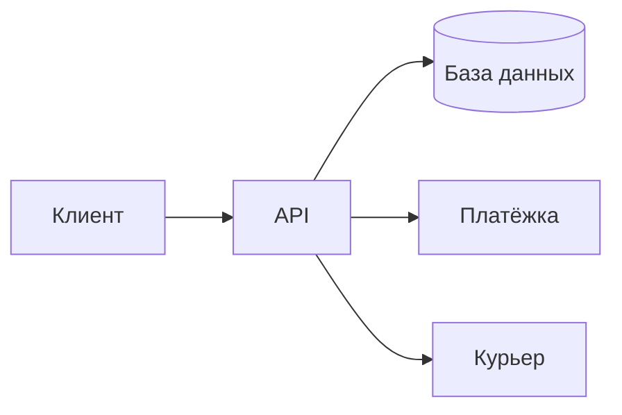

# Архитектура системы SmartDelivery

## 1. Жизненный цикл заказа

```mermaid
sequenceDiagram
    participant Клиент
    participant API

    Клиент->>API: Создание заказа
```

---

## 2. Обработка заказа

```mermaid
flowchart TD
    A[Создание заказа] --> B[Проверка данных]
    B --> C{Корректно?}
    C -->|Да| D[Продолжить]
    C -->|Нет| E[Ошибка]
```

---

## 3. Компоненты системы

```mermaid
flowchart LR
    Клиент --> API
    API --> БД[(База данных)]
    API --> Платёжка
    API --> Курьер
```