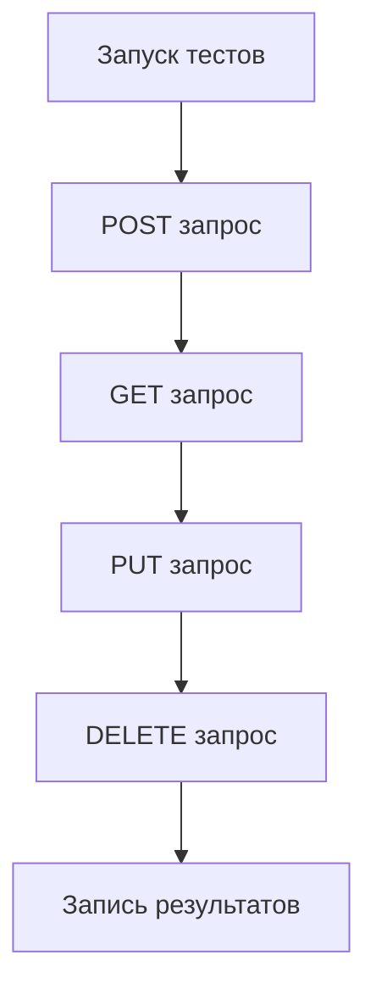

# Тестирование API SmartDelivery

## 📦 Установка зависимостей

```bash
pip install requests
```

---

## 🚀 Запуск тестов

### Вариант 1 (Python напрямую)

```bash
python tests/api_tests.py
```

---

### Вариант 2 (автоматический скрипт)

Linux / Mac:

```bash
bash tests/run_tests.sh
```

Windows:

```bash
tests/run_tests.bat
```

---

## 📊 Что тестируется

В проекте реализованы CRUD тесты:

- POST — создание заказа
- GET — получение заказа
- PUT — обновление заказа
- DELETE — удаление заказа

---

## 🔁 Схема тестирования



---

## 📄 Пример вывода

```
[CREATE] Status: 201
[GET] Status: 200
[UPDATE] Status: 200
[DELETE] Status: 200
```

---

## 🎯 Итог

Тесты проверяют корректность работы API и демонстрируют базовые операции REST.